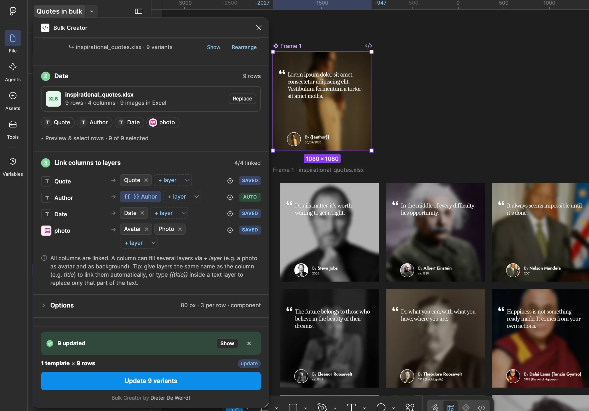

# Bulk Creator — Figma plugin

Create dozens of variants of a design (social posts, stories, banners…) in one click, based on an Excel or CSV file.



*A quote template (top) and its variants generated from an Excel file with quotes, authors, dates and photos.
The photo column fills both the avatar and the blurred background; `By {{author}}` is filled in via a placeholder.*

## Installation (development plugin)

1. Download or clone this repository: `git clone https://github.com/dieterdeweirdt/FigmaBulkCreator.git`
   (or on GitHub: **Code → Download ZIP**). The built plugin is already in `dist/`, so you don't need Node.
2. Figma desktop → **Plugins → Development → Import plugin from manifest…** → choose `manifest.json`.
3. Run it via **Plugins → Development → Bulk Creator**.

If you change anything in `src/`, run `npm run build` (requires Node). `npm run watch` rebuilds automatically on every change in `src/`.
`npm run example` creates `examples/example-campaign.xlsx` to test with.

## How it works

1. **Templates** — select one or more frames (e.g. a post, story and banner). They show up in the plugin right away.
   If you select something else later, the plugin asks whether you want to use or add that selection.
2. **Data** — drop an `.xlsx`, `.xls` or `.csv` file into the plugin. The first filled row contains the column names.
   Optionally pick another sheet and uncheck the rows you don't want.
3. **Link** — columns are linked to layers automatically. If that doesn't work, choose the layer from the list
   or click ◎ and click the layer on the canvas. Click the icon in front of a column to switch between text and image.
4. **Images** — images placed in the Excel file itself or linked via a URL are picked up automatically.
   Only when the Excel file contains file names (e.g. `citywalk.jpg`) does this step appear: drop the folder with your photos there.
5. **Generate** (or `⌘/Ctrl + Enter`).

## What the Excel file can look like

| id  | title          | subtitle                    | price | photo                  |
|-----|----------------|-----------------------------|-------|------------------------|
| p01 | Summer in Ghent| Festival package for two    | € 49  | https://…/summer.jpg   |
| p02 | City walk      | Discover the hidden corners | € 15  | citywalk.jpg           |

Images can be:
- a **URL** (the server must allow external access; Dropbox links are converted automatically),
- an **image inside the Excel file** — the easiest option, nothing else to add:
  *Insert → Insert Picture → Place in Cell → Picture from File…*. A picture floating on top of a cell works too
  (it belongs to the cell under its top-left corner).
- a **file name** (`citywalk.jpg` or `photos/citywalk.jpg`) — you add the photos in step 4.

## Automatic linking

A column is linked to a layer when:
- the layer name equals the column name (`title`, `#title`, `Title` — case and symbols don't matter),
- they are synonyms (title/headline/titel, price/prijs, cta/button/knop, photo/image/foto, …; English and Dutch),
- there is a single image column: the plugin then picks the largest layer with an image that isn't a logo or icon.

### Placeholders inside text

Type `{{column name}}` inside a text layer to replace **only that part** of the text — no linking needed:

| Text in the template        | Result                    |
|-----------------------------|---------------------------|
| `Only {{price}} per night`  | Only € 49 per night       |
| `{{author}}, {{date}}`      | Steve Jobs, 2005          |
| `Quote {{nr}}`              | Quote 3 (row number)      |

- Case and spaces don't matter (`{{ Price }}` works too).
- Styling is kept: if `{{price}}` is bold in a regular sentence, the price will be bold.
- Placeholders are always filled from the template, so updating with a new Excel file works as well.
- A placeholder that doesn't match a column stays as-is; the plugin warns you about it.

### Multiple layers per column

One column can fill **several layers**: add an extra layer via **+ layer** (or ◎). Handy to use a profile picture
both as an avatar and as a blurred background — just put a *Layer blur* on that layer in the template.
Layers named like the column (e.g. `photo` and `photo blur`) are both linked automatically.

Text columns go to text layers. Image columns replace the **image fill** of a layer (rectangle, ellipse, frame…);
if the layer has no image fill yet, one is added.

## Where do the variants go?

For each template a **frame** is placed below the templates (handy to export in one go), with all variants side by side.
Multiple templates are stacked, in the same order as on the canvas. Set the spacing and "variants per row" under *Options*.

## Edit the template → variants follow

By default your frame is converted to a **component** and the variants are **instances**. Everything you change in
the template (colours, fonts, positions, extra layers…) is applied to all variants automatically.
What comes from the Excel file (text, photo) is kept per variant.

When a template is resized while the plugin is open, the variants are realigned automatically.
Otherwise, click **Rearrange** next to the set.

## Uploading the same Excel file again

For each template the plugin remembers which Excel file was used (by file name or identical columns), the links,
and which variant belongs to which row. When you upload the same file again, you choose:
- **Update existing variants** — rows are matched by a row key (an `id` column, otherwise the shortest unique column,
  otherwise the row number; adjustable under *Options*). If a key has changed (e.g. you edited the text), the variant on
  the same Excel row is updated. New rows get a new variant; optionally, variants of removed rows are deleted.
  Variants that no longer match a row are moved to the end and their name starts with ⚠.
- **Create a new set** — the old set stays where it is.

## Good to know

- Missing fonts: layers using a font that isn't installed are skipped (you'll get a warning).
- Images larger than 4096 px or in WebP/AVIF are converted automatically for Figma.
- Empty cells: choose under *Options* whether to keep the template content, clear the layer or hide it.
- Large numbers in Excel's "General" format (shown as `1.11111E+18`) are written out in full.
- A template that is already a component stays that component. A component set itself can't be used; pick one of its variants.

## Structure

```
manifest.json     Figma plugin manifest (points to dist/)
src/code.js       Figma side: read layers, create variants, layout
src/ui.html       Interface: read Excel, link columns, fetch images
vendor/           SheetJS (Excel) and fflate (extract images from .xlsx)
build.js          Bundles everything into dist/ui.html + dist/code.js
```

## License

© 2026 Dieter De Weirdt. You may use the plugin for free, including commercially, and freely use the designs you make with it.
You may share the plugin unmodified and free of charge, crediting the author and this repository.
Selling it, or distributing a modified version, is not allowed.
See [LICENSE](LICENSE) for the full terms. Third-party libraries: see [vendor/LICENSES.md](vendor/LICENSES.md).
